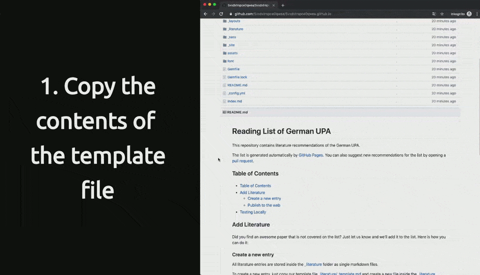

# Reading List of German UPA

This repository collects literature worth reading from the field of Usable Security and Privacy. The list is managed by the German UPA and everyone can contribute to it by creating a [pull request] on GitHub. After reviewing the request, we will add the new literature entry to the list.

The list is generated automatically by [GitHub Pages] and is available at [usprl.github.io]

## Table of Contents

<!-- TOC depthFrom:2 depthTo:6 withLinks:1 updateOnSave:1 orderedList:0 -->

- [Table of Contents](#table-of-contents)
- [Add Literature](#add-literature)
	- [Create a new entry](#create-a-new-entry)
	- [Publish to the web](#publish-to-the-web)
- [Testing Locally](#testing-locally)

<!-- /TOC -->

## Add Literature

Did you find an awesome paper that is not covered on the list? Just let us know and we'll add it to the list.
Here is how you can do it:

### Create a new entry

All literature entries are stored inside the [_literature] folder as single markdown files.

To create a new entry, just copy our template file [_literature/_template.md] and create a new file inside the [_literature] folder. Please use the following convention to name the literature files:

`[last name of first author]-[year]-[first word of publication title].md`

> Example: If you like to create a new entry for the publication **Users are not the enemy** by _Anne Adams and Martina Angela Sasse_, published in the year 1999, the file has to be named `adams-1999-users.md`.

The template includes all infomation need to describe the literature entry in the YAML-header of the markdown file. Here is a description of are all the required parameters in the file:

Parameter  | Type         | Description
-----------|--------------|---------------------------------------------------------------------------------
title      | String       | The title of the publication
authors    | List[String] | All Authors of the publication (First and last name)
release    | String       | Details of corresponding publication (e.g. Conference, year, publisher)
categories | List[String] | All categories matching this publication
keywords   | List[String] | All keywords matching this publication (e.g. taken from the publication itself)
link       | String       | URL linking to the publication (preferably the Open Access version if available)
comment    | String       | Comment regarding the publication

### Publish to the web

After you created a new literature entry, you can ask us to add it to the reading list. Just create a [pull request] containing the Markdown file for this purpose.

After we approved your pull request, you can find the new entry in the list.

## Testing Locally

If you like to test the reading list locally, just follow these steps:

1. Clone the repository
2. Install [Jekyll](https://jekyllrb.com)
3. Execute the following commands in the locally cloned repository
  ~~~
  $ bundle install
  $ bundle exec jekyll serve
  ...
  Server address: http://127.0.0.1:4000/
  Server running... press ctrl-c to stop.
  ~~~

You can now locally view the list by opening http://127.0.0.1:4000/ in the browser.

[GitHub Pages]: https://pages.github.com/
[usprl.github.io]: https://usprl.github.io/
[_literature]: /_literature
[_literature/_template.md]: /_literature/_template.md
[pull request]: https://help.github.com/en/articles/about-pull-requests